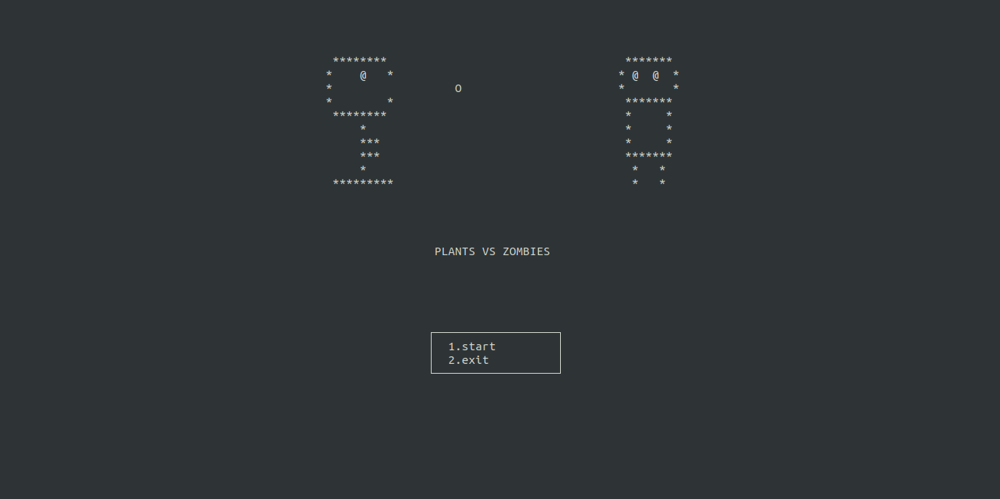
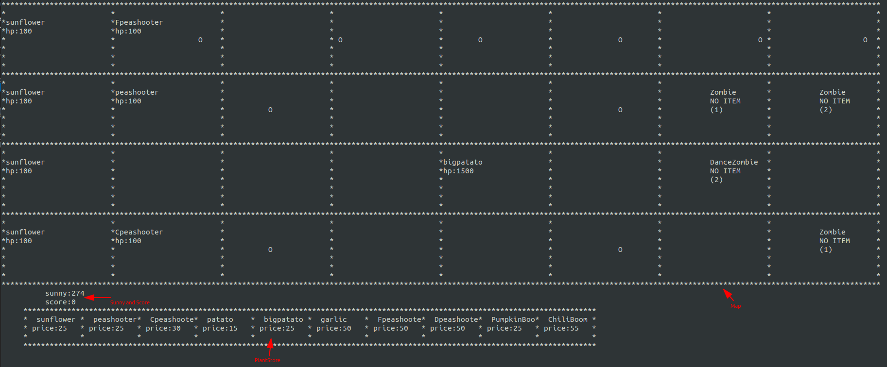
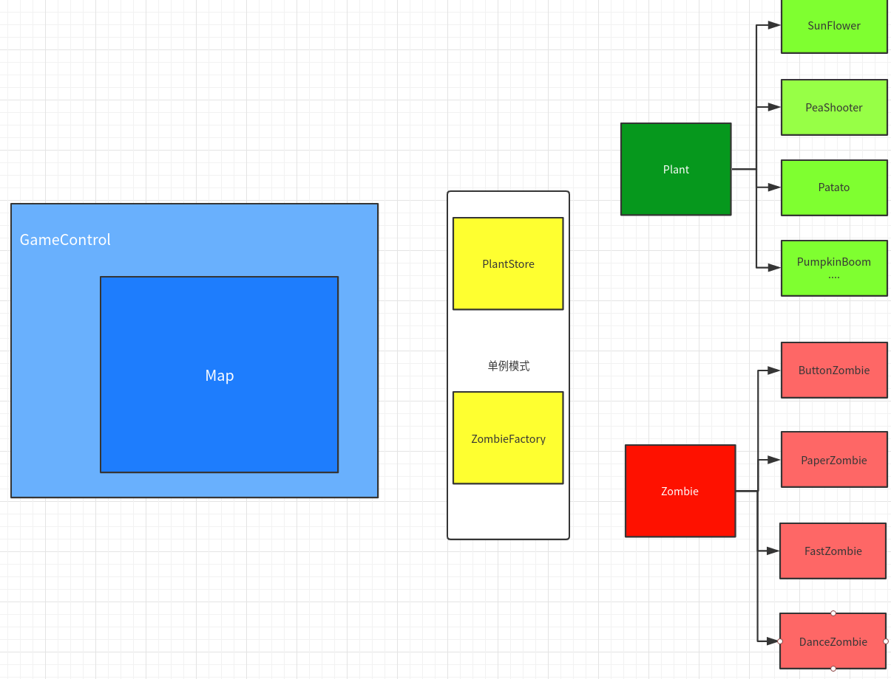

# PLANTS.VS.ZOMBIE  
161220151 许嘉帆  
  
## 功能描述  
实现了简单的植物大战僵尸程序，使用鼠标点击操作。  


### 玩法说明
游戏前需要先安装ncurse库  
```
$sudo apt-get install libncurses5-dev  
```

在当前目录下输入**make run**启动游戏  
  
点击start开始游戏  
  
在图中，地图有4行8列，僵尸会从左边开始进攻，你需要使用阳光在下方的商店中购买你需要的植物（click），再点击需要种植的格子，植物将会被种植在目标格子中，防守不要让僵尸到达地图的最左端。  
### PLANTS
|植物|说明|
|---|:---|
|SunFlower|向日葵，定时生成阳光|
|PeaShooter|豌豆射手，射出攻击豌豆|
|Potato|坚果墙，阻挡僵尸进攻|
|BigPotato|更大的坚果墙|
|Garlic|大蒜，僵尸攻击后会移动到相邻行|
|ColdPeaShooter|寒冰射手，射出减速豌豆|
|FastPeaShooter|快速射手，快速射出豌豆|
|DoublePeaShooter|双头射手，在当前行和相邻行都能射出豌豆|
|PumpkinBoom|南瓜炸弹，在当前格造成巨额伤害|
|ChiliBoom|辣椒炸弹，在当前行造成巨额伤害|

### ZOMBIES
|植物|说明|
|---|:---|
|Zombie|普通僵尸|
|RoadBlockZombie|路障僵尸，更高耐久|
|BucketZombie|铁桶僵尸，更高耐久|
|PaperZombie|读报僵尸，在报纸掉落后速度更快|
|FastZombie|快速僵尸，速度快耐久低|
|DanceZombie|舞王僵尸，会召唤小僵尸|

## 代码组织
### 类构造和继承关系


#### GameControl
GameControl类负责控制游戏的准备界面，游戏界面，结束界面之间的切换，当进入游戏界面时，大部分工作由Map类完
成。  
#### Map
Map类主要负责游戏过程中的状态更新，资源分配，输入处理等，在4行8列的地图中，如何管理其中运行的僵尸和植物？每一格中可以有多个僵尸，我设置了一个二维的vector来负责存放各个僵尸的指针，以及一个植物指针的二维数组用于管理4*8格中的植物。运行中的子弹我是使用了一整个vector来存放。  
每个周期来临时，逐个格子判断僵尸。如果当前格子有植物，僵尸开始对植物攻击，否则则向前移动，如果植物死亡则释放其存储空间。  
逐个格子判断植物，根据植物种类来更新，比如sunflower会提供阳光，shooter会生成子弹，boom会爆炸等等。  
然后遍历所有在场上的bullet，如果超出了地图或者攻击到僵尸，则将其删除，僵尸如果被杀死则释放其空间。  
#### PlantStore
PlantStore是一个单例模式生成的类，其中有一个plant类的指针数组，指向所有的植物的一个实例对象，当需要购买植物的时候，调用函数会返回一个指针，然后map类根据这个指针copy一个植物放置到目标位置即可。  

#### ZombiesFactory
ZombiesFactory也是一个单例模式生成的类，当需要生成僵尸时，会根据需要的僵尸种类new一个返回回去。  

#### Plant
植物类型的基本性质有name，hp，attack，price，type等，其基类是一个抽象类，因为各个植物之间均有区别，所以我将基本的功能和所需要的函数抽象出来，其余的由虚函数来在具体的类中实现。Map类中保存的是保存的是Plant类型指针，所以在执行的时候可以通过动态绑定来确定具体需要执行的函数。  
比如我有多个Shooter植物，他们会产出不同的bullet，这时，使用基类型的指针以及虚函数可以很快的实现动态绑定。  

#### Zombie
僵尸类型的基本性质有name，hp，attack，speed，item等，item我使用类来描述，各个僵尸有一个共同的基类Zombie类，这个类也用于描述普通僵尸类，因为其他僵尸都是在此基础上添加物品技能等。  
比如PaperZombie在item被攻击消失时会提升速度，在调用hurt方法时需要使用动态绑定。


### 程序执行流程
```
while(1){
   map_update		
/*********
 * 生成新僵尸
 * 僵尸前进/攻击/技能
 * 植物更新（阳光，射击）
 * 子弹射击
 *********/
   input
/*********
 * 根据点击的区域确定状态改变
 *********/
}
```
## 问题和解决方法

### 获取鼠标输入
```
        while(1){
            show();
            timeout(0);
            key = getch();
            if(key == KEY_MOUSE){
                getmouse(&event);
                input(event);
            }
        }
```
在这段程序中，使用ncurse库中的调用鼠标的函数可以获得鼠标时间，然后用timeout()函数来防止获取事件时的阻塞。

### 如何确定鼠标点击的目标？
在ncurse的获取鼠标事件时，能够获得其点击的坐标，我使用了一个button结构体，用于描述Map中可以点击的图块。然后再根据其点击的图块，进行相应的更新。

